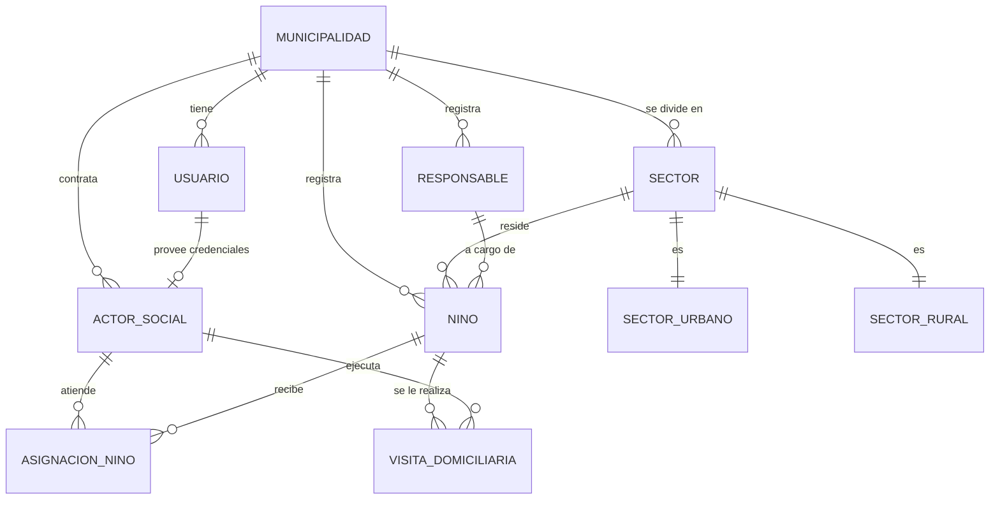

# Guía del Desarrollador: Arquitectura y Semillas

Este documento técnico detalla la arquitectura del proyecto, el esquema de datos y el funcionamiento del cargador de datos de prueba (DataLoaders).

---

## 1. Estructura del Monorepo

El proyecto está organizado en un monorepo administrado con `pnpm workspaces`:

- **`apps/api`**: El backend desarrollado con Node.js, Express y TypeScript.
- **`packages/`**: Espacio reservado para librerías de tipos o configuraciones compartidas en el futuro.
- **`docs/`**: Documentación funcional y manuales del sistema.

---

## 2. Diagrama Entidad-Relación (Base de Datos)

El esquema de base de datos utiliza PostgreSQL y Prisma. A continuación se presenta el mapa de relaciones principales:



---

## 3. DataLoaders (Semillas de Base de Datos)

Para facilitar el desarrollo local e integraciones, se han desarrollado cargadores de datos idempotentes en `apps/api/src/dataloaders/`.

### Jerarquía y Secuencia de Carga:

Al ejecutar la semilla, los cargadores se ejecutan en orden estricto para evitar fallas por relaciones no resueltas:

1. **`initial-admin`**: Crea el super-administrador general (`SEED_ADMIN_USERNAME`).
2. **`tipos-actor-social`**: Inicializa perfiles de actores con tarifas.
3. **`municipalidades`**: Registra los municipios de prueba (`POM`, `LIM`, `VIC`).
4. **`entidades`**: Entidades de soporte.
5. **`cargos-miembro-grupo`**: Cargos para nóminas municipales.
6. **`centros-poblados`**: Ubicaciones geográficas de prueba.
7. **`usuarios-municipales`**: Crea credenciales para supervisores y admins de cada municipalidad.
8. **`sectores`**: Configura zonas, manzanas o coordenadas.
9. **`grupos-trabajo`**: Crea conformaciones y sus miembros asociados.
10. **`actores-sociales`**: Vincula los actores a grupos de trabajo y sectores, y les genera su usuario.
11. **`responsables`**: Padres o tutores a cargo.
12. **`ninos`**: Menores vinculados a responsables y sectores.
13. **`asignaciones-ninos`**: Asigna niños a actores sociales específicos para seguimiento.
14. **`visitas-domiciliarias`**: Registra visitas pasadas (ejecutadas) y próximas visitas del calendario.

### Comandos Clave del Backend:

Todos los comandos deben ejecutarse desde la raíz del monorepo usando `pnpm` o dentro de `apps/api/`:

- **Levantar base de datos y migrar:**
  ```bash
  pnpm --filter @visitas/api db:migrate
  ```
- **Ejecutar DataLoaders (Carga de Semillas):**
  ```bash
  pnpm --filter @visitas/api db:seed
  ```
- **Ejecutar Pruebas Unitarias de Loaders:**
  ```bash
  pnpm --filter @visitas/api test
  ```
- **Verificar Tipos de TypeScript:**
  ```bash
  pnpm --filter @visitas/api typecheck
  ```

---

## 4. Guía para Agregar Nuevas Semillas

Si necesitas agregar una nueva tabla de semillas:
1. Crea un archivo `nuevo-modelo.loader.ts` dentro de `apps/api/src/dataloaders/`.
2. Define tu arreglo `DEFAULT_NUEVOS_DATOS` e implementa la función `seedNuevoModelo`. Asegura que sea **idempotente** validando primero si el registro existe.
3. Crea su test unitario en `nuevo-modelo.loader.test.ts` mockeando las llamadas a Prisma usando `vi.fn()` de Vitest.
4. Importa y llama tu cargador dentro de [run.ts](file:///home/rvelasco/Proyectos/visitas-domiciliarias/apps/api/src/dataloaders/run.ts) en la posición correspondiente del flujo de dependencias.
