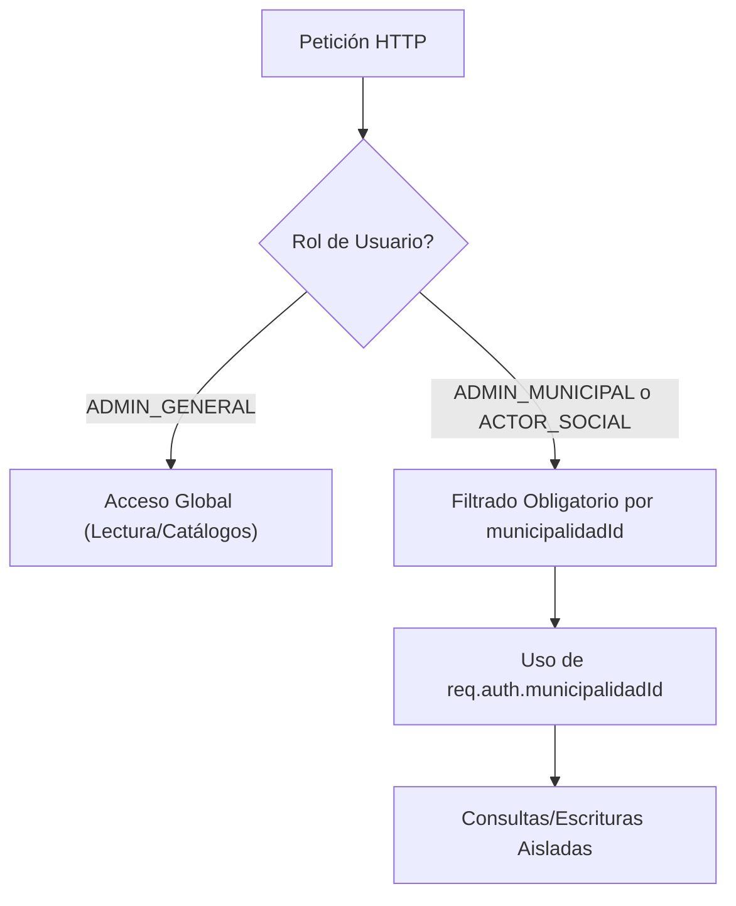
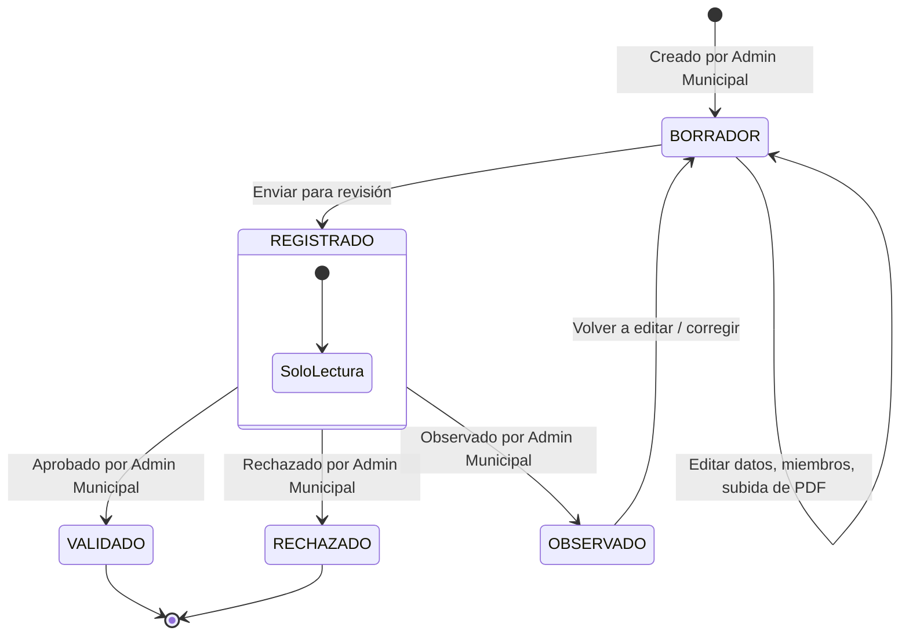
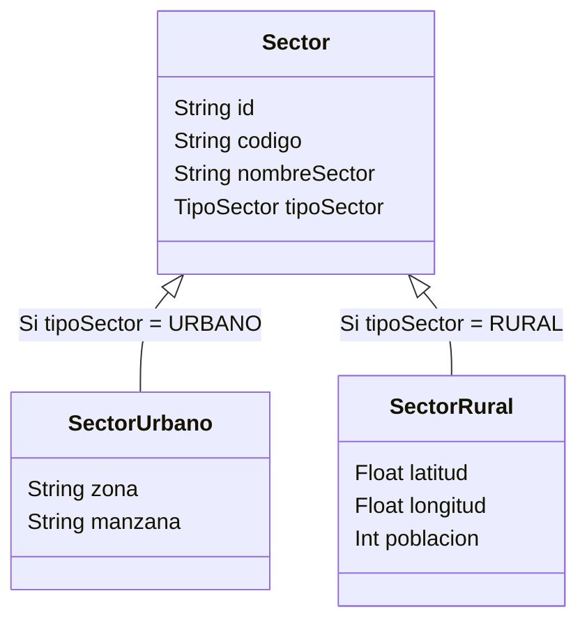
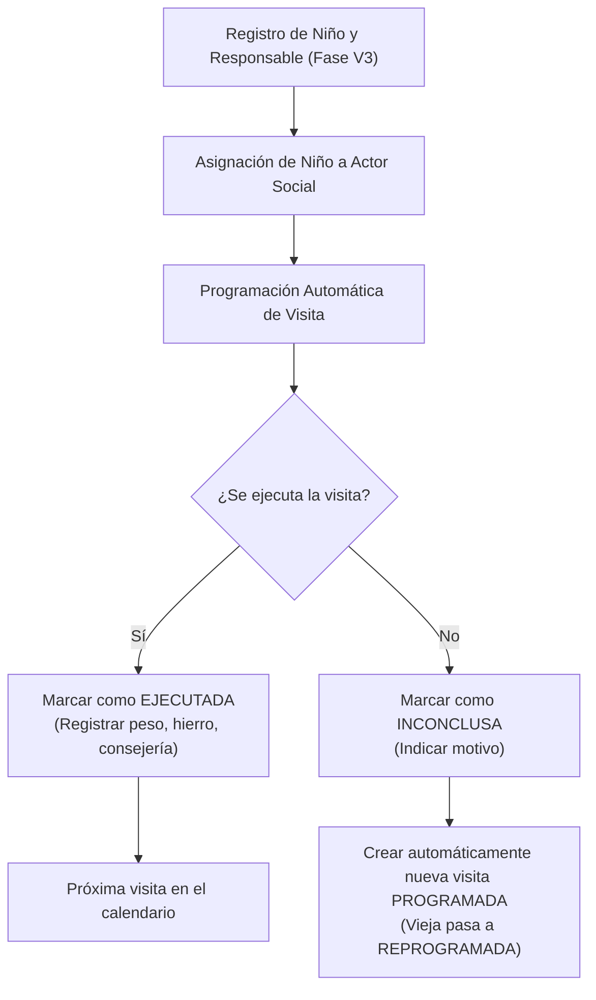

# Flujos de Trabajo y Fases del Sistema

Este documento describe detalladamente los flujos operativos, las transiciones de estados y la lógica de negocio aplicable a las visitas domiciliarias de salud materno-infantil.

---

## 1. Modelo de Aislamiento Multi-Municipalidad

El sistema está diseñado para dar soporte a múltiples municipalidades sobre una base de datos unificada, pero garantizando el aislamiento absoluto de los datos a nivel operativo.

> [!IMPORTANT]
> A excepción del `ADMIN_GENERAL`, todas las consultas y mutaciones de datos en el backend deben aplicar estrictamente un filtro basado en el `municipalidadId` recuperado del token JWT verificado (`req.auth.municipalidadId`).

---

## 2. Ciclo de Vida de los Grupos de Trabajo

La conformación y formalización de un Grupo de Trabajo pasa por un flujo secuencial de estados.

### Reglas de Negocio en V1:
- **BORRADOR / OBSERVADO:** Estado de preparación. Se permite editar la información general, agregar/quitar establecimientos o miembros, y subir archivos adjuntos en formato PDF.
- **REGISTRADO:** Bloqueado a modo de solo lectura. El Administrador Municipal es notificado para que revise el acta y la nómina de integrantes.
- **VALIDADO (APROBADO):** El grupo es formalmente validado. Se considera activo y apto para vincular Actores Sociales a su jurisdicción.
- **DNI Representante Único:** No se permite que el DNI del representante esté duplicado en otro grupo de trabajo activo dentro de la misma municipalidad.

---

## 3. Sectores Territoriales (Urbano vs. Rural)

Los sectores representan la subdivisión geográfica de atención de la salud de la municipalidad. Un sector debe ser estrictamente **Urbano** o **Rural**, pero **nunca ambos**.

> [!TIP]
> Los validadores de Zod en el backend comprueban que si se provee la estructura `urbano`, el campo `rural` sea nulo, y viceversa, impidiendo inconsistencias espaciales.

---

## 4. Flujo Operativo de Niños y Visitas Domiciliarias

El flujo operacional se divide en registro, asignación territorial y control de visitas de seguimiento de menores de 1 año (de 0 a 5 meses y de 6 a 12 meses).

### Reglas de la Visita Domiciliaria:
1. **Idempotencia y Secuencia:** Cada niño tiene asignado un único Actor Social activo en un momento dado.
2. **Reprogramación Automática:** Si una visita no puede realizarse (marcada como `INCONCLUSA`), se genera en la base de datos un nuevo registro en estado `PROGRAMADA` para una fecha futura y el registro anterior se actualiza a `REPROGRAMADA` guardando el motivo de la no ejecución.
3. **Pérdida de Trazabilidad:** Los niños y visitas no se eliminan físicamente. La desactivación u ocultación requiere una eliminación lógica con justificación de motivo (archivado).
