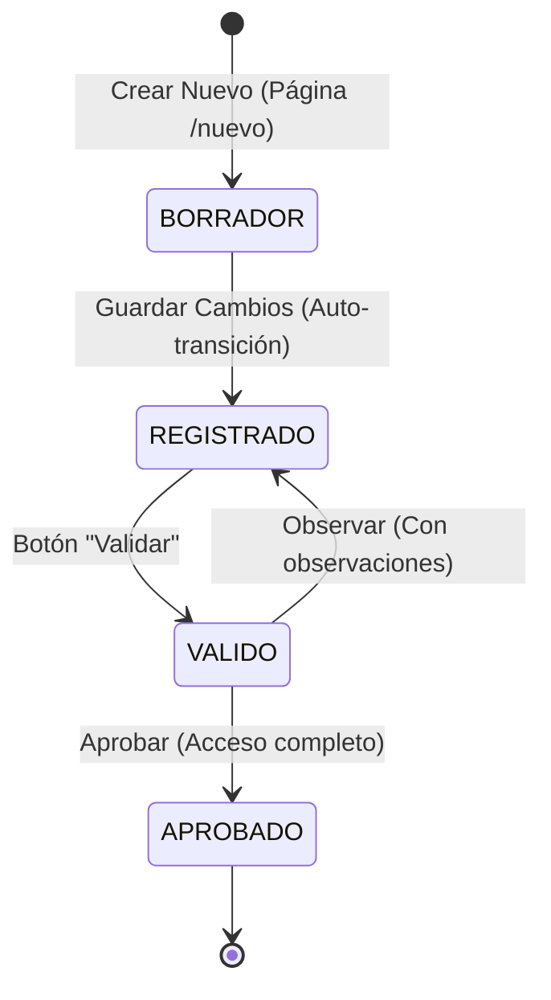

# Plan de Implementación: Nuevo Flujo de Estados y Creación por Página

Este documento describe el plan estructurado para rediseñar el flujo de estados y la interfaz de usuario para **Grupo de Trabajo** (Fase 1) y **Actores Sociales** (Fase 2) de acuerdo con los nuevos requerimientos y la maqueta referencial.

---

## Objetivos Principales
1. **Eliminar modales de creación**: Sustituir el formulario de creación en modal por una página dedicada (`/nuevo`).
2. **Implementar el flujo de 4 estados**:
   * **Borrador (`BORRADOR`)**: Solo se rellena información básica. La sección inferior de pestañas (miembros, establecimientos, etc.) está oculta.
   * **Registrado (`REGISTRADO`)**: Se desbloquea la sección inferior, pero solo se visualizan los documentos ("Otros Documentos"). Botón principal cambia a "Validar".
   * **Valido (`VALIDO`)**: Modo lectura. Espera revisión del Administrador/Supervisor.
   * **Aprobado (`APROBADO`)**: Fin del flujo. Acceso total a todas las funciones (establecimientos, miembros, actas, etc.).
3. **Manejo de Observaciones**: Si el supervisor observa el registro, este vuelve a estado **Registrado** mostrando el campo "Observaciones". Si se aprueba, pasa a **Aprobado**.
4. **Listados Filtrados**: Asegurar que en pantallas operativas (como la asignación en Actores Sociales) solo aparezcan grupos de trabajo con estado **Aprobado**.

---



---

## Fase 1: Grupo de Trabajo (Conformación)

### 1. Cambios en Base de Datos (Prisma)
* **Enum de Estados**:
  Modificar `EstadoGrupoTrabajo` en `schema.prisma` para alinearlo con los nuevos estados:
  ```prisma
  enum EstadoGrupoTrabajo {
    BORRADOR
    REGISTRADO
    VALIDO
    APROBADO
  }
  ```
  *(Nota: Se eliminan `OBSERVADO` y `RECHAZADO`, ya que la observación regresa el registro a `REGISTRADO` conservando la columna `observaciones`).*
* **Migración**: Ejecutar `prisma migrate dev` para propagar los cambios y actualizar registros existentes en la base de datos de pruebas.

### 2. Cambios en el Backend (API)
* **Validación de Esquema**: Actualizar `grupoTrabajoCreateSchema` y `grupoTrabajoUpdateSchema` en Zod para soportar la nueva estructura de estados.
* **Transiciones de Estado**: Asegurar que el endpoint de actualización de estado admita únicamente las transiciones válidas:
  * De `BORRADOR` a `REGISTRADO`.
  * De `REGISTRADO` a `VALIDO`.
  * De `VALIDO` a `REGISTRADO` (Observado) o `APROBADO` (Aprobado).

### 3. Cambios en el Frontend (Web App)
* **Rutas (`AppRouter.tsx`)**:
  Añadir ruta para creación:
  * `/grupos-trabajo/nuevo` -> Renderiza el formulario de creación (mismo diseño que `GrupoDetailPage` pero vacío y en modo creación).
* **Pantalla de Listado (`GruposPage.tsx`)**:
  * Cambiar el botón `+ Nuevo grupo` para que navegue a `/grupos-trabajo/nuevo` en lugar de abrir el modal.
* **Detalle e Interfaz (`GrupoDetailPage.tsx`)**:
  * **Stepper**: Actualizar los pasos a `Borrador > Registrado > Valido > Aprobado`.
  * **Layout en Borrador**:
    * Mostrar solo el formulario de información básica (Gobierno Local y Grupo de Trabajo).
    * Ocultar completamente la sección inferior de pestañas (Establecimientos, Miembros, Otros Documentos, Actas).
    * Botón de acción: **Guardar** (al hacer clic, realiza `POST` y redirige a `/grupos-trabajo/:id` ya en estado `REGISTRADO`).
  * **Layout en Registrado**:
    * Desbloquear la sección inferior, pero ocultar las pestañas de Establecimientos, Miembros y Actas. Solo mostrar la pestaña **Otros Documentos** para carga de archivos.
    * Mostrar campo **Observaciones** si tiene texto previo (proveniente de un rechazo/observación anterior).
    * Botón de acción: cambia de "Guardar" a **Validar** (al hacer clic, pasa a estado `VALIDO`).
  * **Layout en Valido**:
    * Formulario de información básica y carga de documentos pasan a modo de solo lectura (`disabled`).
    * Para Administradores/Supervisores: Mostrar botones **Aprobar** (pasa a `APROBADO`) y **Observar** (abre modal para ingresar observaciones y regresa a `REGISTRADO`).
  * **Layout en Aprobado**:
    * Desbloquear todas las pestañas de la sección inferior (Establecimientos, Miembros, Otros Documentos, Actas).
    * Información básica en modo lectura.

---

## Fase 2: Actores Sociales

### 1. Cambios en Base de Datos (Prisma)
* **Enum de Estados**:
  Alinear `EstadoActorSocial` para que coincida con la simplificación a 4 estados si se desea consistencia completa, o mantener intermediate states (`CAPACITADO`) de ser necesario.
  Recomendado unificar a:
  ```prisma
  enum EstadoActorSocial {
    BORRADOR
    REGISTRADO
    VALIDO
    APROBADO
  }
  ```

### 2. Cambios en el Frontend (Web App)
* **Filtrado de Grupos de Trabajo**:
  Modificar `gruposOptions` en `ActoresSocialesPage.tsx` para listar **únicamente** los grupos de trabajo que tienen `estado === "APROBADO"`.
* **Rutas (`AppRouter.tsx`)**:
  Añadir ruta para creación:
  * `/actores-sociales/nuevo` -> Renderiza el formulario de creación en página dedicada en lugar de modal.
* **Pantalla de Detalle (`ActoresSocialesPage.tsx`)**:
  * Aplicar el mismo comportamiento del flujo de estados:
    * **Borrador**: Ocultar secciones inferiores de asignación territorial (Sectores, Manzanas). Solo campos básicos de contacto y credenciales. Botón "Guardar" pasa el registro a "Registrado".
    * **Registrado**: Desbloquear sección inferior de asignación de sectores. Botón principal cambia a "Validar" (pasa a "Valido").
    * **Valido**: Solo lectura para el usuario de campo. Botón de aprobación para supervisor.
    * **Aprobado**: Acceso total e inalterable.
