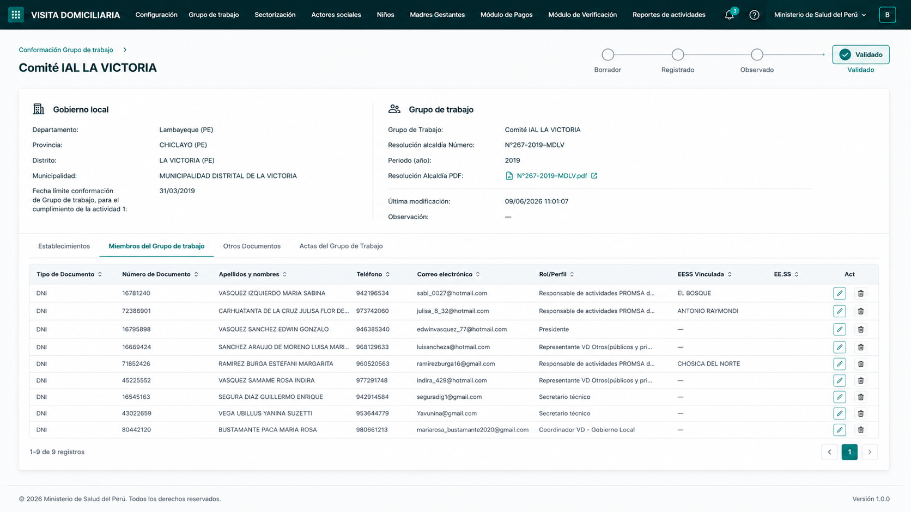
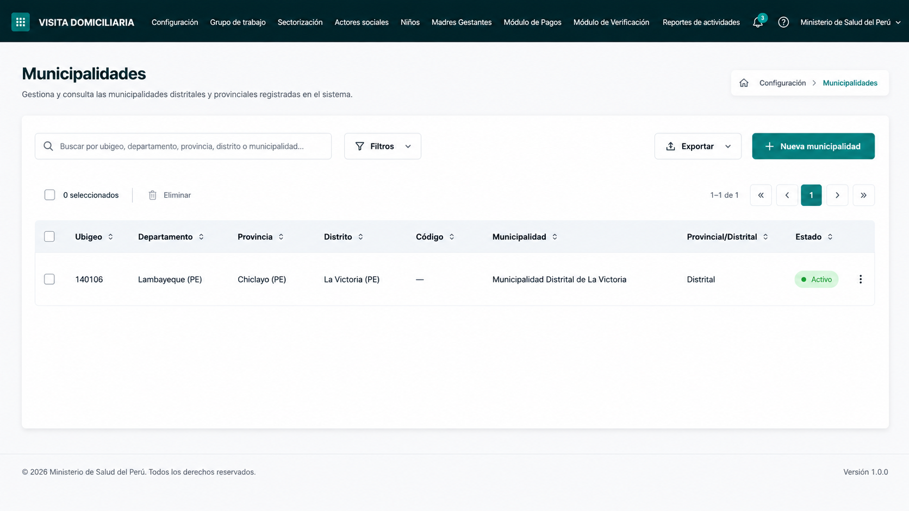
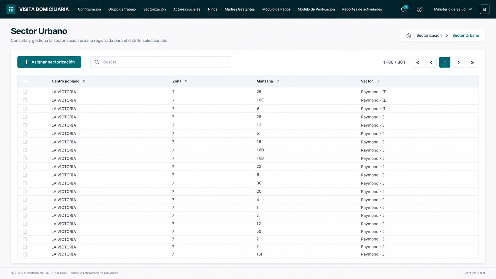
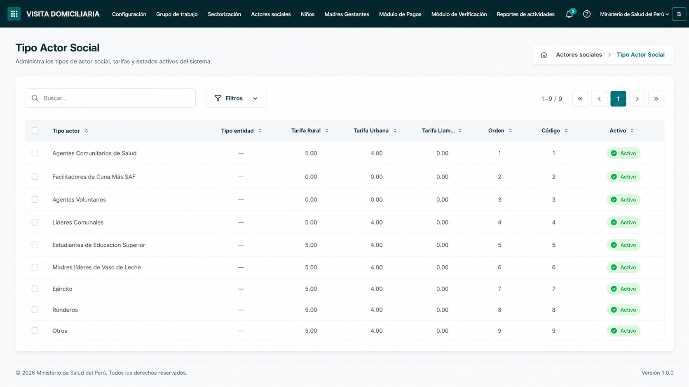

# Implementación 1 Frontend V1: infraestructura, autenticación y arquitectura modular

El backend de la V1 (Express + Prisma + Postgres) ya está finalizado y validado. Esta primera implementación del frontend se realiza en `apps/web` usando React + Vite + TypeScript.

## 1. Principio arquitectónico obligatorio

El frontend debe mantenerse con **arquitectura modular por dominio/feature**, evitando concentrar la lógica en un único `App.tsx`, en carpetas genéricas excesivas o en componentes acoplados a todos los módulos.

La estructura base propuesta para `apps/web/src` es:

```txt
apps/web/src/
  app/                    # Configuración raíz de la aplicación
    App.tsx
    providers/
  routes/                 # Definición de rutas y guards
    AppRouter.tsx
    ProtectedRoute.tsx
  shared/                 # Infraestructura reutilizable sin dominio propio
    api.ts
    config.ts
    errors.ts
  features/               # Módulos funcionales por dominio
    auth/
      auth-storage.ts
      auth-types.ts
      password-strength.ts
      pages/
        LoginPage.tsx
        ForgotPasswordPage.tsx
        ResetPasswordPage.tsx
    dashboard/
      pages/
        DashboardHomePage.tsx
    municipalidades/
    entidades/
    tipos-actor-social/
    cargos-miembro-grupo/
    grupos-trabajo/
    sectores/
    actores-sociales/
  styles/                 # Estilos globales, tokens y utilidades visuales
    global.css
```

Reglas de modularidad:

1. Cada módulo en `features/` debe agrupar sus páginas, componentes, tipos y servicios específicos.
2. `shared/` solo debe contener utilidades transversales: cliente HTTP, configuración, errores, helpers puros o componentes verdaderamente genéricos.
3. Las rutas deben importar páginas de cada feature, pero la lógica de negocio de cada feature debe quedarse dentro de su módulo.
4. Las pantallas protegidas deben depender del estado de autenticación y rol, no de variables globales dispersas.
5. Las futuras tablas/formularios de V1 deben reutilizar patrones comunes, pero sin crear abstracciones prematuras antes de tener dos o tres módulos implementados.

## 2. Estado actual de la aplicación

- Stack: React 19, Vite, TypeScript y pnpm.
- Backend base: `/api/v1`.
- La mayoría de endpoints requieren `Authorization: Bearer <token>`.
- La app actual de `apps/web` solo contiene una pantalla informativa inicial; no tiene ruteo, cliente API ni manejo de sesión.

## 3. Alcance de esta primera implementación

Esta tanda implementa únicamente la base necesaria para comenzar el frontend V1:

1. Instalar `react-router-dom`.
2. Crear cliente API centralizado en `shared/api.ts`:
   - base URL configurable;
   - serialización JSON;
   - inyección automática de `Authorization: Bearer <token>`;
   - lectura de errores del backend;
   - evento de sesión expirada ante HTTP 401.
3. Crear manejo de sesión en `features/auth`:
   - persistencia en `localStorage`;
   - restauración al recargar;
   - logout centralizado;
   - tipos de usuario autenticado y rol.
4. Configurar rutas:
   - `/login`;
   - `/forgot-password`;
   - `/reset-password?token=XYZ`;
   - `/` como dashboard protegido;
   - guard de autenticación para rutas privadas.
5. Crear pantallas iniciales:
   - Login;
   - Solicitud de recuperación de contraseña;
   - Restablecimiento de contraseña con validación visual de fortaleza.
6. Crear estilos base premium:
   - tokens CSS;
   - fuente desde Google Fonts;
   - modo claro/oscuro preparado por variables;
   - botones, inputs, cards, mensajes y layout responsive.

## 4. Flujo de autenticación

### Login

- El usuario ingresa `username` y `password`.
- Se llama a `POST /api/v1/auth/login`.
- La respuesta esperada es:

```json
{
  "accessToken": "jwt",
  "user": {
    "id": "uuid",
    "username": "admin",
    "rol": "ADMIN_GENERAL",
    "municipalidadId": null,
    "actorSocialId": null
  }
}
```

- El token y usuario se guardan en `localStorage`.
- La app redirige al dashboard protegido.

### Recuperación de contraseña

- `/forgot-password` solicita el email.
- Llama a `POST /api/v1/auth/forgot-password` con `{ "email": "..." }`.
- Muestra el mensaje devuelto por el backend o un error entendible.

### Restablecimiento de contraseña

- `/reset-password?token=XYZ` lee el token desde query string.
- El usuario ingresa una nueva contraseña.
- La UI valida en tiempo real:
  - mínimo 8 caracteres;
  - al menos una mayúscula;
  - al menos una minúscula;
  - al menos un número;
  - al menos un carácter especial permitido o equivalente: `_`, `$`, `*`, `@`, `#` u otro no alfanumérico compatible con backend.
- Si cumple, llama a `POST /api/v1/auth/reset-password` con `{ "token": "XYZ", "password": "..." }`.
- Al terminar, ofrece volver al login.

## 5. Dashboard y roles en esta primera tanda

El dashboard inicial será un shell mínimo protegido. Debe mostrar:

- usuario autenticado;
- rol;
- navegación preparada para futuras secciones;
- botón de cerrar sesión.

La visibilidad de navegación quedará preparada para:

- `ADMIN_GENERAL`:
  - Municipalidades;
  - Entidades;
  - Tipos de Actor Social;
  - Cargos de Miembro.
- `ADMIN_MUNICIPAL`:
  - Grupos de Trabajo;
  - Sectores;
  - Actores Sociales.

En esta primera implementación, esas rutas pueden quedar como tarjetas informativas o enlaces deshabilitados si todavía no se implementan sus CRUDs.

## 6. Criterio visual para páginas posteriores al login

El login define la identidad visual base de la V1: verdes institucionales, superficies claras, bordes suaves, buen espaciado y modo oscuro preparado.

Para las páginas internas posteriores al login se debe mantener el mismo esquema de colores y tokens visuales, pero con una presentación más sobria:

1. Menos elementos decorativos que en el login.
2. Animaciones mínimas o inexistentes, limitadas a estados de hover/focus.
3. Layouts administrativos claros: barra superior, tarjetas simples, tablas y formularios legibles.
4. Priorizar velocidad de uso y claridad de datos sobre efectos visuales.
5. Reutilizar variables CSS existentes antes de crear nuevos colores.

## 7. Navegación interna y agrupación de opciones

La barra superior del dashboard no debe quedarse solo como encabezado informativo. En esa misma zona donde actualmente aparece “Panel V1 / Visitas Domiciliarias” debe vivir también la navegación principal de la aplicación.

Como la V1 y las fases posteriores tendrán varias opciones, las rutas deben agruparse por dominio funcional. La intención es que el usuario no vea una lista larga de enlaces sueltos, sino menús claros y compactos.

Agrupación propuesta para navegación:

| Grupo | Opciones | Notas de alcance |
| --- | --- | --- |
| Configuración | Municipalidades, Entidad, Tipo Actor Social | Mantenimiento global/base. También puede incluir Cargos de Miembro si se decide agrupar todos los catálogos administrativos. |
| Grupo de Trabajo | Conformación de Grupo de Trabajo | Debe cubrir grupo, establecimientos y miembros administrativos. |
| Sectorización | Sector Urbano, Sector Rural | En backend el sector sigue siendo un módulo con regla urbano/rural excluyente; en frontend puede dividirse visualmente para facilitar operación. |
| Actores Sociales | Registro Actores Sociales | Registro, edición permitida, activación, estado y archivado. |
| Niños | Panel de Visitas | Corresponde a fases posteriores; dejar previsto, no implementar en la primera tanda V1. |
| Reportes | Reporte Actividad, otros reportes operativos | Corresponde a fases posteriores; dejar previsto como grupo futuro. |

Criterios de diseño para esta navegación:

1. Usar una barra superior sobria y administrativa.
2. Mantener la paleta ya aprobada, pero reducir personalización/ornamentos en páginas internas.
3. Usar agrupaciones tipo menú/dropdown o navegación colapsable cuando haya muchas opciones.
4. Mostrar opciones según rol y fase habilitada.
5. Evitar tarjetas grandes como navegación principal permanente; las tarjetas pueden existir como resumen, pero la navegación diaria debe estar en la barra superior.
6. Mantener preparadas opciones futuras como Niños y Reportes, pero sin activar rutas funcionales hasta su fase correspondiente.

## 8. Módulos V1 que se implementarán después

Después de cerrar infraestructura y auth, la V1 frontend puede avanzar por módulos independientes:

1. **Municipalidades** (`features/municipalidades`)
   - listado;
   - crear/editar;
   - activar/inactivar.

2. **Entidades** (`features/entidades`)
   - listado;
   - crear/editar;
   - activar/inactivar;
   - archivar.

3. **Tipos de Actor Social** (`features/tipos-actor-social`)
   - tarifas rural/urbana;
   - código;
   - orden;
   - activar/inactivar;
   - archivar.

4. **Cargos de Miembro** (`features/cargos-miembro-grupo`)
   - crear/editar;
   - activar/inactivar.

5. **Grupos de Trabajo** (`features/grupos-trabajo`)
   - listado;
   - creación de grupo;
   - detalle del grupo;
   - creación de establecimientos;
   - creación y edición limitada de miembros;
   - toggle activo/inactivo de miembros;
   - eliminación visual con modal “Por Implementar”.

6. **Sectores** (`features/sectores`)
   - listado;
   - crear/editar;
   - urbano/rural excluyente;
   - activar/inactivar;
   - archivar.

7. **Actores Sociales** (`features/actores-sociales`)
   - listado;
   - crear actor con usuario y contraseña;
   - editar datos permitidos;
   - cambiar estado funcional;
   - activar/inactivar;
   - archivar;
   - eliminación visual con modal “Por Implementar”.

## 9. Criterios de aceptación de esta primera implementación

La primera implementación queda aceptada si:

1. `pnpm --filter @visitas/web build` termina correctamente.
2. La app permite navegar entre login, forgot-password y reset-password.
3. El login consume el endpoint real del backend y persiste la sesión.
4. Al recargar la página se restaura la sesión guardada.
5. Las rutas privadas redirigen a `/login` si no hay sesión.
6. Un HTTP 401 desde el cliente API dispara limpieza de sesión.
7. La contraseña del reset muestra validación visual en tiempo real.
8. La estructura de carpetas deja el frontend listo para crecer por módulos V1.

### Imagenes Referenciales de como seran lass paginas:
#### Detalle de un Grupo De Conformación


#### Municipalidades


#### Sector Urbano


#### Tipo Actor Social

